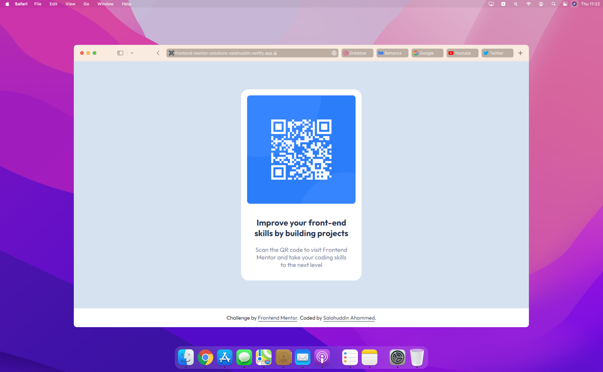

# Frontend Mentor - QR code component solution

This is a solution to the [QR code component challenge on Frontend Mentor](https://www.frontendmentor.io/challenges/qr-code-component-iux_sIO_H). Frontend Mentor challenges help you improve your coding skills by building realistic projects.

## Table of contents

- [Frontend Mentor - QR code component solution](#frontend-mentor---qr-code-component-solution)
  - [Table of contents](#table-of-contents)
  - [Overview](#overview)
    - [Screenshot](#screenshot)
    - [Links](#links)
  - [My process](#my-process)
    - [Built with](#built-with)
  - [Author](#author)

## Overview

### Screenshot

### Links

- Solution URL: [GitHub](https://github.com/SalahuddinAhammed/frontend-mentor-solutions/tree/main/projects/qr-code-component)
- Live Site URL: [Netlify](https://frontend-mentor-solutions-salahuddin.netlify.app/qr-code-component)

## My process

### Built with

- Semantic HTML5 markup
- CSS

## Author

- GitHub - [Salahuddin Ahammed](https://github.com/SalahuddinAhammed)
- Frontend Mentor - [@SalahuddinAhammed](https://www.frontendmentor.io/profile/SalahuddinAhammed)
